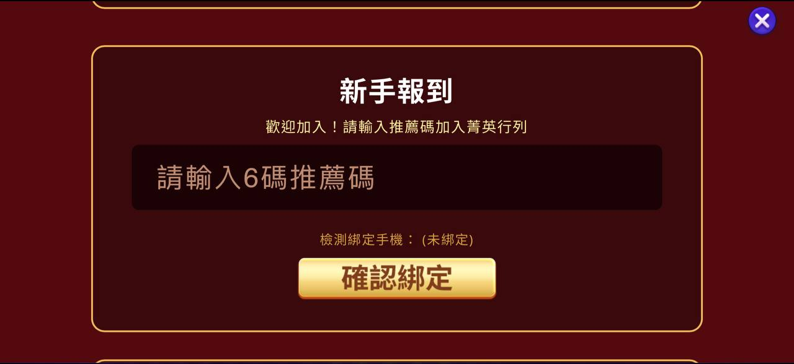
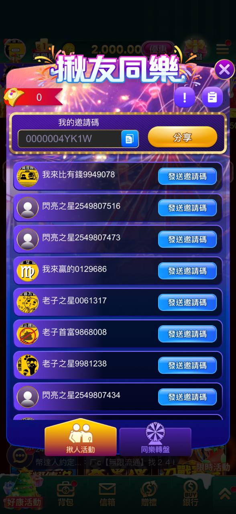
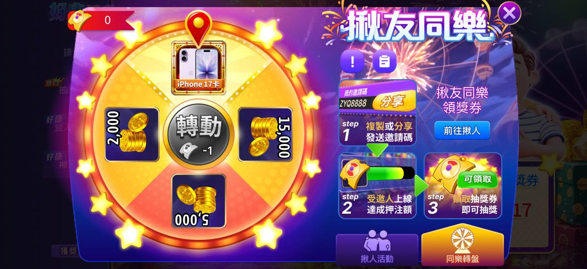
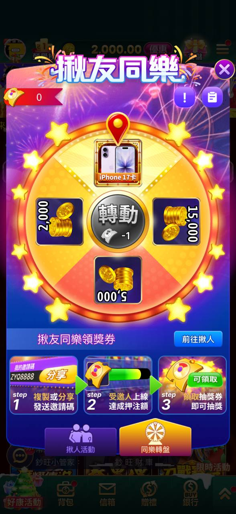
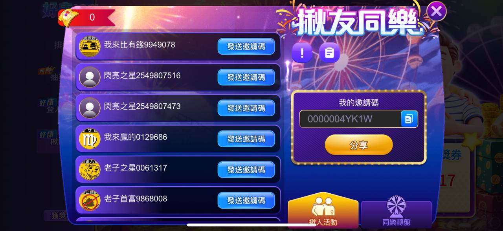
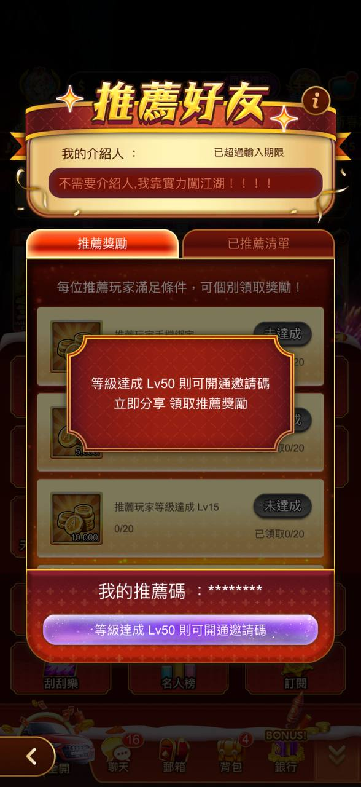
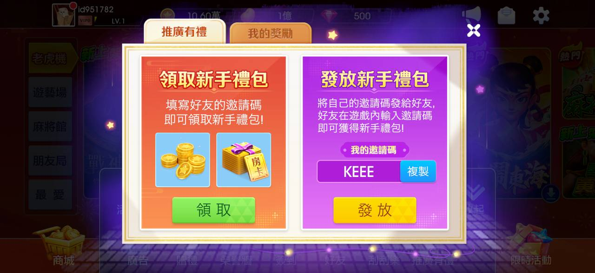
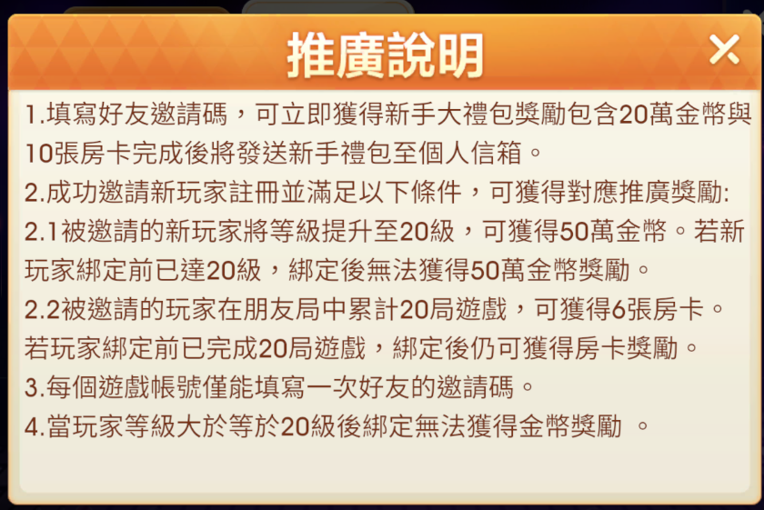
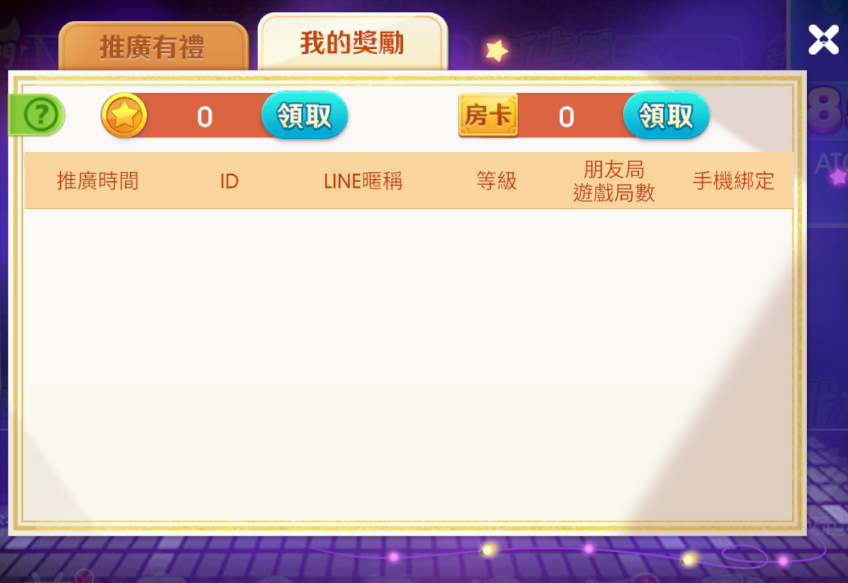

# 人拉人

> 資料來源：慶宜ㄉ競品平台活動.xlsx（人拉人）

  - 滿貫 — 豪神 — 老子 — 王牌 — 嚦咕
- 活動名稱 — 好友升等你拿獎 — 揪友同樂 — 推薦好友
- 活動期間 — 1/14~2/28
- 新人條件 — ● 創立帳號並達到10等 ● 綁定手機門號 — ● 創立帳號並達到5等 ● 綁定手機門號 — ● 儲值記錄 ● 綁定手機門號  * 回歸玩家(7日以上，回歸後30日未登入)也可以
- 新手帳號價格
- 老手回饋 — 金條 金幣 — 金幣 — 獎項較多元 — 金幣
- 問題 — Ｑ：10等約等於多少台幣？
## 滿貫
    
    > 圖說：新手報到彈窗，需輸入6碼推薦碼綁定，並顯示手機綁定狀態
## 豪神
  
  > 圖說：好友升等你拿獎橫幅，含專屬邀請碼、邀請好友/助力好友/好友列表按鈕及App下載QR code
    - 1. 邀請好友
    - 發送自己的邀請碼給好友，好友獲取遊戲並綁定手機門號，輸入你的邀請碼，成功邀請好友數即可 +1。
    - 2. 助力好友
    - 等級達到5級之前，綁定手機門號，輸入好友的邀請碼，即可成功助力好友。
    - 注意： 同裝置若創立多個帳號，將無法輸入邀請碼。
    - 3. 領寶箱
    - 每成功邀請 5位好友，即可領取寶箱獎勵 50,000 豪幣（此獎勵可重複獲得）。
    - 4. 查看已邀請好友列表
    - 好友達成等級 — 可獲得獎勵 (豪幣)
    - 20級 — 20000
    - 50級 — 50000
    - 100級 — 100000
    - 500級 — 200000
    - 1,000級 — 500000
  - 如果您成功邀請了 5 位好友，且這些好友的留存與活躍度不同，您的預期收益為：
  - 保底流失型： 5人都只完成綁定，沒怎麼玩
  - 領取一個寶箱 = 50,000 豪幣
  - 輕度玩家型： 5人都玩到 100 級 — 著重「大戶」養成： 這套規格非常鼓勵老玩家去帶新玩家，尤其是 Lv.500 以後的獎勵跳幅很大（從 20萬 跳到 50萬），能有效激勵邀請者輔導新手留存。
  - 1個寶箱 (50k) + 5人 × 累計獎勵 (170k) = 900,000 豪幣
  - 核心骨灰型： 5人都衝到 1,000 級
  - 1個寶箱 (50k) + 5人 × 累計獎勵 (870k) = 4,400,000 豪幣
## 老子
  
  > 圖說：揪友同樂頁面，顯示我的邀請碼與已邀請好友清單（含ID、送遊戲幣按鈕）
    
    > 圖說：揪友同樂轉輪抽獎頁（與登入頁類似版面）
      
      > 圖說：揪友同樂活動首頁，含轉輪抽獎與金幣/房卡獎勵，下方有3步驟教學（分享邀請碼→好友加入→即可抽獎）
  
  > 圖說：揪友同樂頁面，我的邀請碼與好友邀請清單
  - 分享碼： 每位玩家擁有一組專屬邀請碼，可分享給 7 天以上未登入 的老玩家。
  - 達成條件： 受邀玩家上線並達成指定之「押注條件」。
  - 領獎抽獎： 受邀玩家領取獎勵後，邀請者可獲得「同樂轉盤券」進行抽獎。
  - 註：若受邀玩家輸入邀請碼，雙方皆可獲得轉盤券。
  - 註：完成首次活動後，若玩家再次超過 30 天未上線，可再次進行「歡迎活動」。
  - 押注計算限制： * 全遊戲的「對押」或「預注」行為不列入押注計算。
  - 「Evolution」 與 「棋牌」 類遊戲的押注額以 0.5 倍 計算。
## 豪神
    
    > 圖說：推薦好友頁，我的介紹人/已邀請人數，等級達Lv50可開通邀請碼並分享
    - 各獎勵最多20份
    - 玩家手機綁定 — 10000
    - LV5 — 5000
    - LV15 — 10000
    - LV30 — 30000
    - LV50 — 60000
    - LV75 — 120000
    - LV100 — 200000
    - 押注升等
## 嚦咕
  
  > 圖說：推薦有禮/我的邀請頁籤，含領取新手禮包／發放新手禮包兩張卡片與搜尋欄
      
      > 圖說：推廣說明彈窗，條列邀請碼綁定規則、新手大禮包（20萬金幣+10張房卡）及好友升級/局數對應的推薦獎勵門檻
    
    > 圖說：推薦有禮/我的獎勵頁籤，顯示房卡與星幣可領取數量及推薦紀錄表格（目前無資料）
