# 格子地圖

> 資料來源：慶宜ㄉ競品平台活動.xlsx（格子地圖）

## 豪神-生肖奪寶
    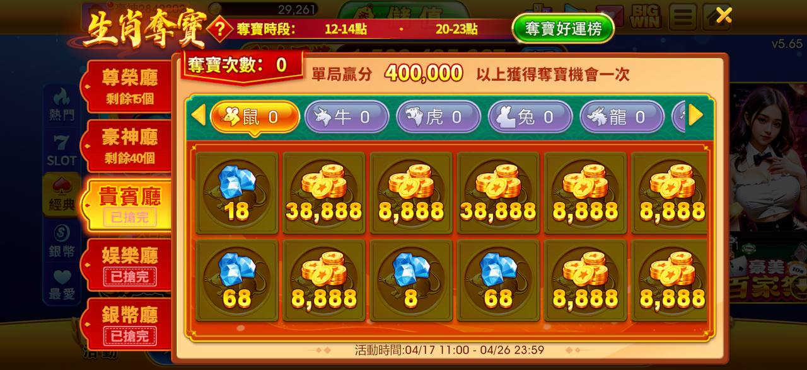
    > 圖說：生肖尋寶賓果盤，指定格數點亮可獲豪幣獎勵，彩金400,000，賓果格子
## 豪神-地圖
    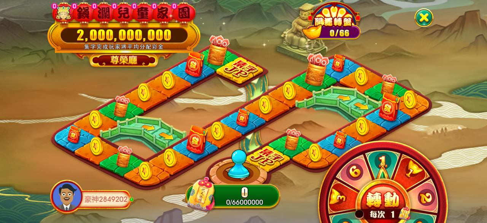
    > 圖說：鎮潮兒童家園彩活動，棋盤路徑遊戲，累積彩金2,000,000,000，轉動按鈕
      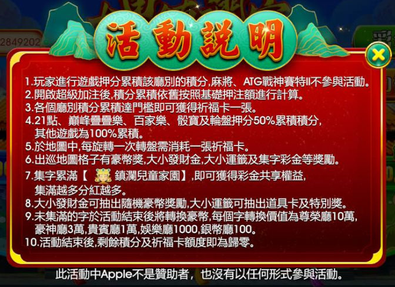
      > 圖說：活動說明長文，遊戲押分累積積分機制與超級加注、各遊戲倍率翻倍規則（百家樂/骰盅/輪盤50%累積積分）、彩卡兌換規則
## 豪神-財神地圖
    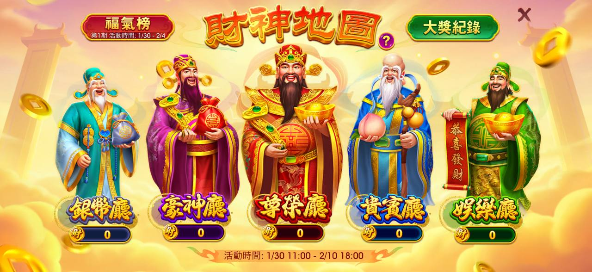
    > 圖說：福氣榜/財神地圖，五路財神（招財神/財神爺/尊爵神/富貴神/嗨運神）大獎紀錄，活動時間1/30-2/10
      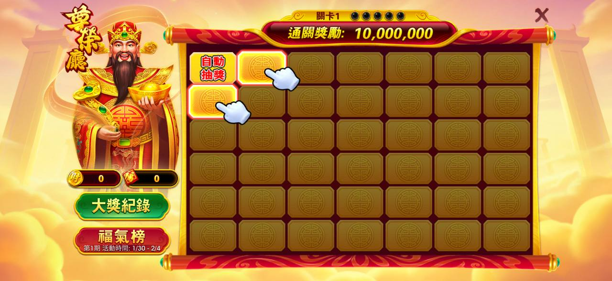
      > 圖說：富貴聚寶刮刮樂，通關獎勵10,000,000，格子刮刮卡版面
  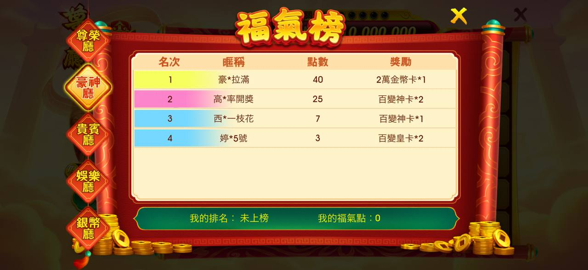
  > 圖說：福氣榜排行榜，列出名次/暱稱/點數/獎勵前四名
  - 銀幣廳 — 娛樂廳 — 貴賓廳 — 豪神廳 — 尊榮廳 — 財神地圖 活動說明
    - 百變皇卡 * 1 — 百變神卡 * 1 — 2萬金幣卡 * 1 — 10萬金塊卡 * 1 — 1. 玩家於各個廳別進行遊戲押分累積積分，可獲得財神道具。
    - 特級卡包 * 2 — 百變皇卡 * 3 — 百變神卡 * 2 — 百變神卡 * 6 — 2. 21點、百家樂、骰寶及輪盤，押分為 50% 累積積分，其他遊戲押分為 100% 累積積分。
    - 特級卡包 * 1 — 百變皇卡 * 1 — 百變神卡 * 1 — 3. 憲哥麻將 及 ATG戰神賽特II 不參與活動。
    - 百變金卡 * 2 — 特級卡包 * 3 — 百變皇卡 * 2 — 4. 玩家使用財神道具於地圖中選擇相鄰的格子前進且抽獎。
    - 特級卡包 * 3 — 5. 根據開啟的格子結果獲得對應的獎勵：
    - 特級卡包 * 2
    - 特級卡包 * 2 — 空格 — X
    - 發財獎 — 隨機獲得豪幣獎勵，最高為 5000萬豪幣。
    - 福袋獎 — 隨機獲得道具卡獎勵，最高為 魔卡。
    - 通關獎 — 抵達即為通關，進入下一關卡，累滿 5 次通關即可獲得通關獎勵。
    - 福氣點 — 隨機活動福氣點數 1-100點，累積其福氣點數，每五天為一週期，每週期福氣點歸零，根據排名進行派發獎勵。
    - 於活動結束後，財神道具及福氣點即為歸零。
## 嚦咕-幸運洞洞樂
    - 一、 如何獲得「剪刀」（活動道具）
    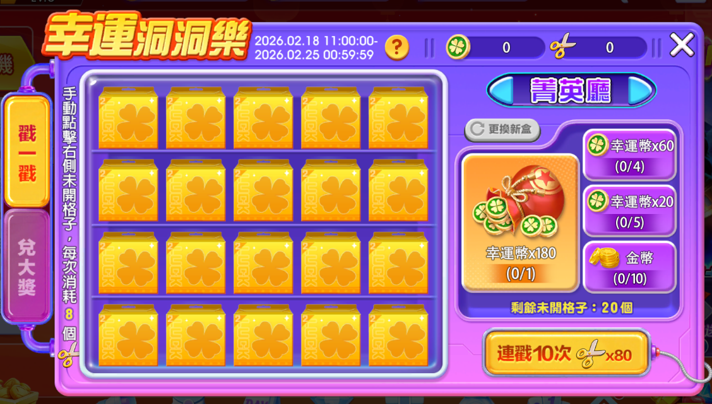
    > 圖說：幸運洞洞樂開獎廳玩法，格子選擇板，連戰10次x80按鈕
    - 累積方式：在活動期間內，進行金幣遊戲押分即可累積「剪刀積分」。
    - 兌換門檻：積分達到指定門檻後，即可獲得剪刀。
    - 分廳累積：不同廳別的積分會分別累積，且換取的剪刀也僅限於對應廳別使用。
    - 例外限制：ATG遊戲不參與此活動。
    - 二、 戳獎規則（核心玩法）
    - 遊戲是以「盒子」為單位進行，每個盒子有 20 個格子，獎項分配如下：
    - 獎項組成：
    - 3 個幸運幣獎項（獲得的幣數固定）。
    - 1 個金幣獎項（獲得的金幣數量隨機）。
    - 操作方式：
    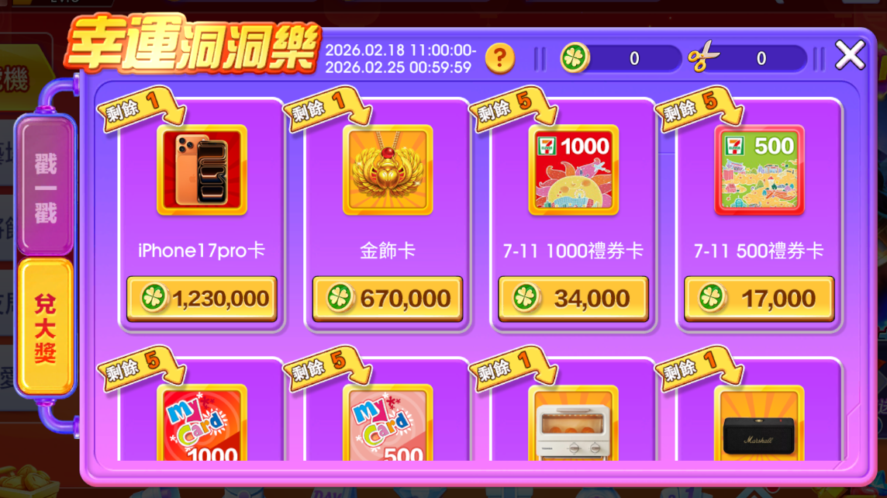
    > 圖說：幸運洞洞樂，2026/2/18-2/25限時，兌換iPhone17pro卡/金幣卡/711商品券等，各需1,230,000～17,000點數
    - 可手動點擊格子，或使用「連戳」功能隨機抽獎。
    - 連戳中止條件：若抽中最大獎或剩餘格子不足，連戳會停止，並退還未消耗的剪刀。
    - 更換新盒：戳獎過程中，玩家可以隨時選擇更換新盒子。
    - 三、 獎勵與結算
    - 幸運幣用途：消耗指定數量的幸運幣可兌換各類超值獎勵。
    - 活動結算：活動結束後，若身上還有未兌換的幸運幣，系統會按一定折損率換算成金幣，並透過信箱發送給玩家。
## 豪神-開運派對
    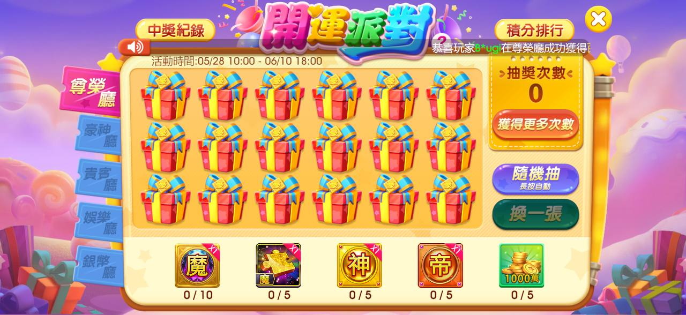
    > 圖說：開運派對，中獎紀錄/積分排行頁籤，活動期間，禮物盒抽獎格，魔/神/金圖騰兌換進度
      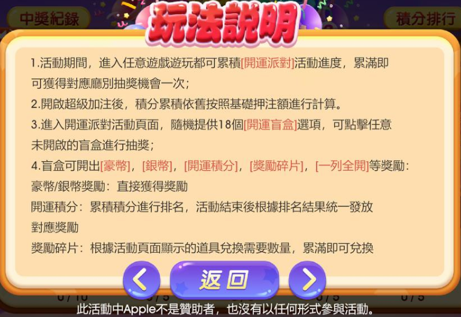
      > 圖說：玩法說明彈窗，說明開運派對盲盒機制（18個盲盒可開出豪幣/銀幣/開運積分/獎勵碎片等）
## 王牌-航海奪寶
    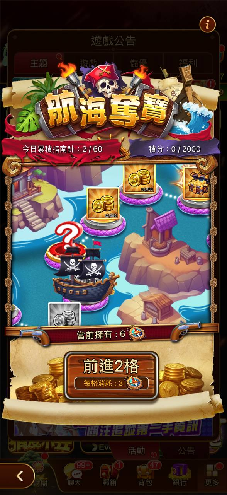
    > 圖說：遊戲公告「那海奪寶」，海盜尋寶主題棋盤活動，顯示今日累積指數與「前進2格」按鈕
  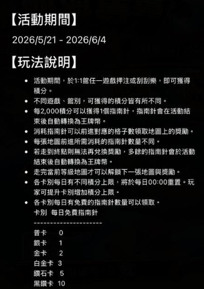
  > 圖說：活動期間2026/5/21-6/4玩法說明，押注或刮刮樂獲得積分，2,000積分兌換1個指南針，各卡別每日免費指南針數量（普卡0～黑鑽卡10）
      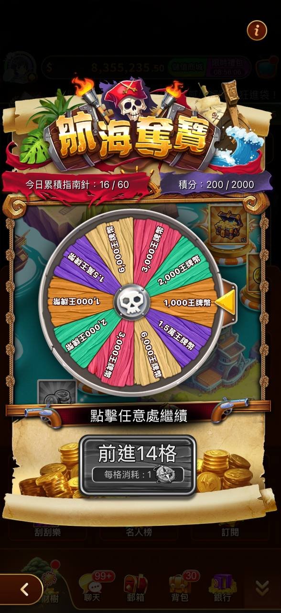
      > 圖說：那海奪寶棋盤活動（另一時點），今日累積指數16/60，前進14格按鈕
## 豪神-Bingo
  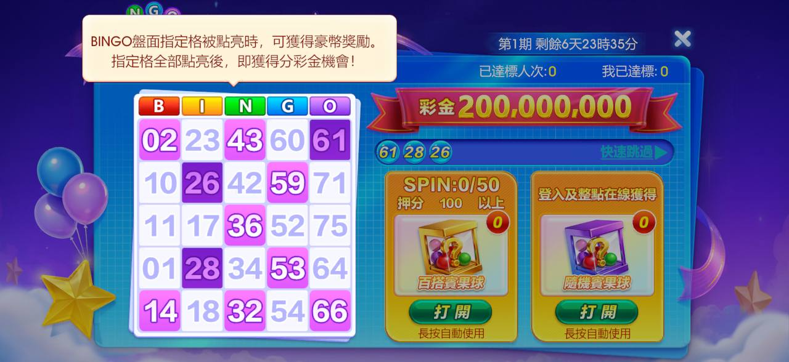
  > 圖說：BINGO賓果盤，指定格數點亮可獲豪幣獎勵，彩金200,000,000，Bingo號碼板
## 王牌-賽龍舟
  
  > 圖說：賽龍舟活動預告，活動期間6/18-7/2，集氣任務與兌換獎勵步驟說明，即將開放按鈕
      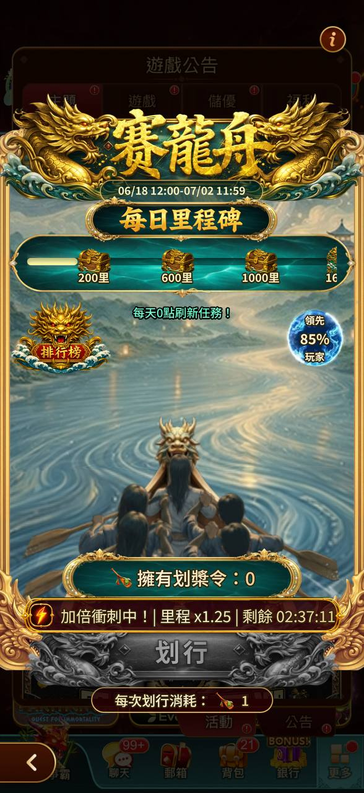
      > 圖說：遊戲公告「賽龍舟」，龍舟競賽主題活動，含每日里程碑進度與划行按鈕
  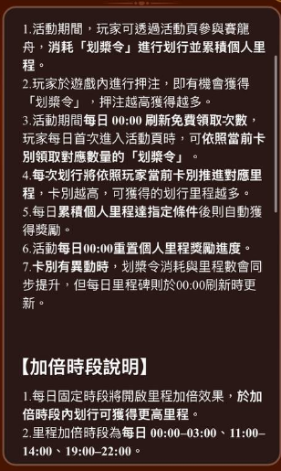
  > 圖說：活動規則說明長文，介紹划槳令／划行里程機制、押注與里程換算規則、每日重置與加倍時段（00:00-03:00、11:00-14:00、19:00-22:00）
  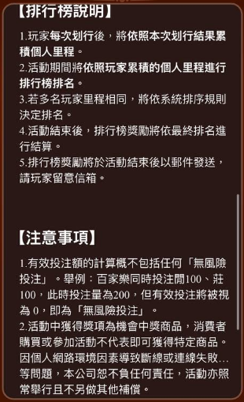
  > 圖說：排行榜說明與注意事項文字，含有效投注額計算規則（無風險投注不列入）及活動獎項免責聲明
