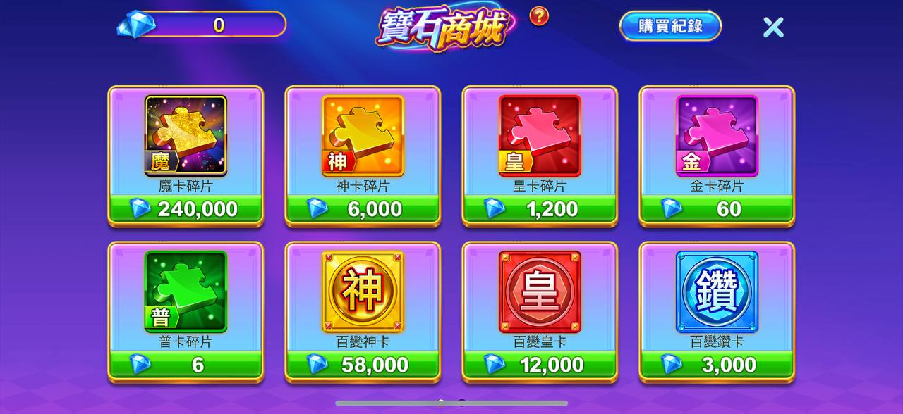
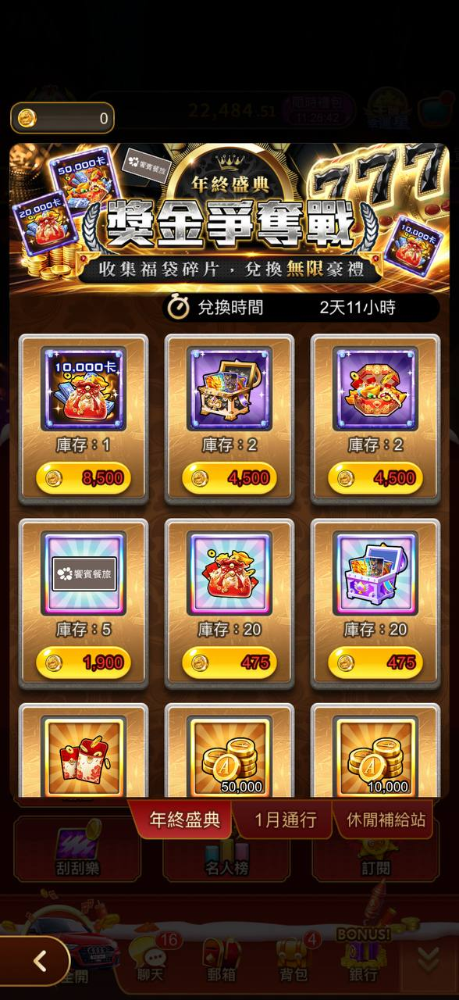
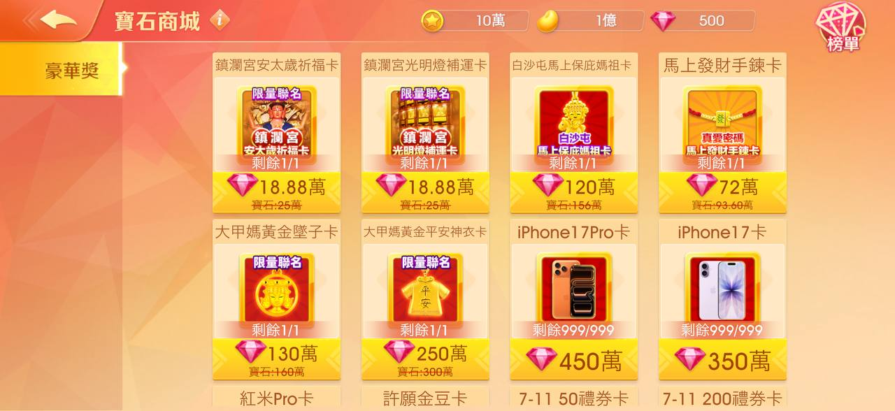

# 實體兌換商城

> 資料來源：慶宜ㄉ競品平台活動.xlsx（實體兌換商城）

  - 包你發 — 豪神 — 嚦咕 — 王牌 — 錢街
  - 包鑽商城 — 寶石商城 — 寶石商城 — 其實比較像是統整起來 — 紫鑽商城
- 幣值
- 貨幣獲得來源 — - 解任務 - 玩遊戲（每10,000） - 綁定300包鑽 — - 憲哥頂刮刮 - 憲哥麻將指定任務 - 平台活動 — - 遊戲中會出現寶石任務 — 解任務
- 可換物品清單
- 實體獎 — O — X — O
- 道具卡 — O — X
- 豪神-寶石商城
    - 道具名稱 — 類型 — 寶石售價 — 備註
  
    - 魔卡碎片 — 碎片 — 240000 — 最高階稀有度
    - 神卡碎片 — 碎片 — 6000
    - 百變神卡 — 萬用卡 — 58000 — 約等於 10 片神卡碎片的價格
    - 百變皇卡 — 萬用卡 — 12000
    - 百變鑽卡 — 萬用卡 — 3000
    - 普卡碎片 — 碎片 — 6 — 基本入門級
- 王牌
    
- 嚦咕
  
