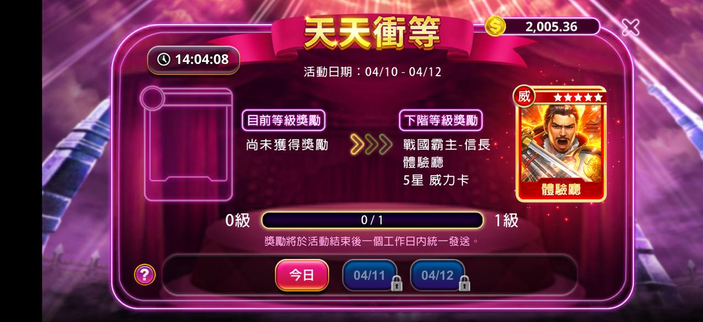
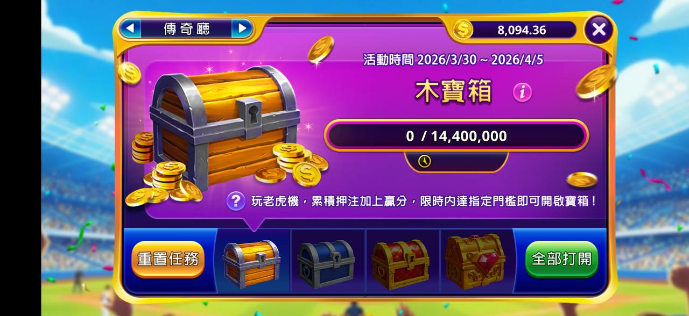
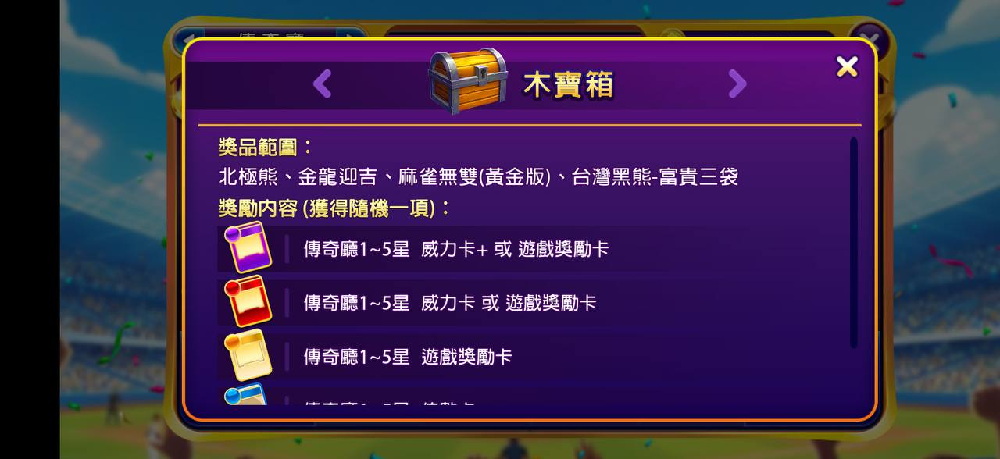
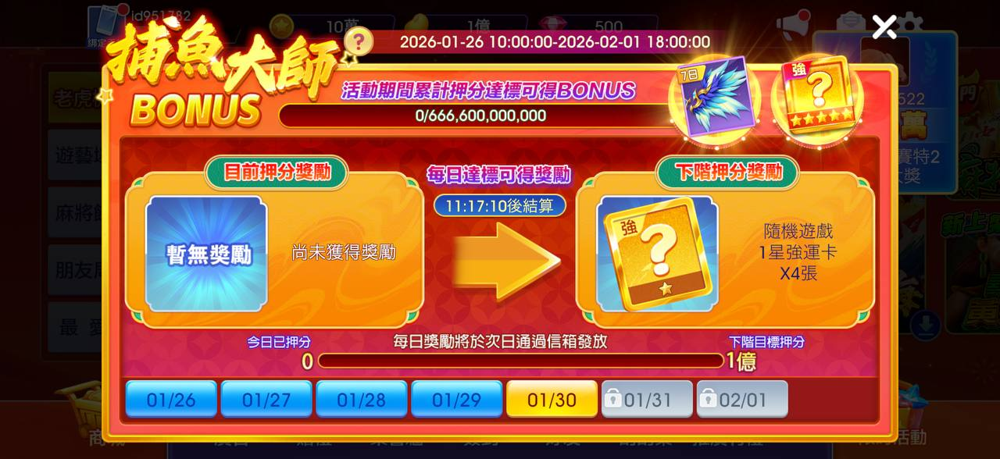
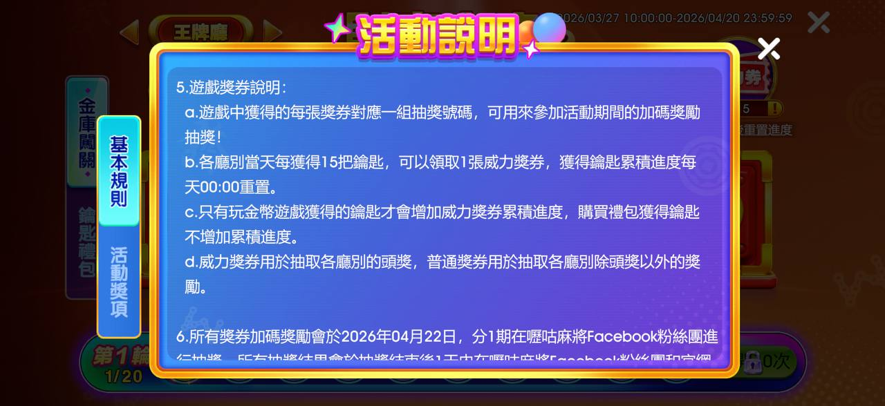
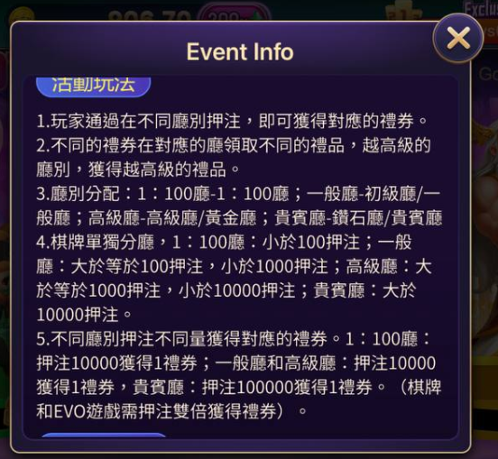
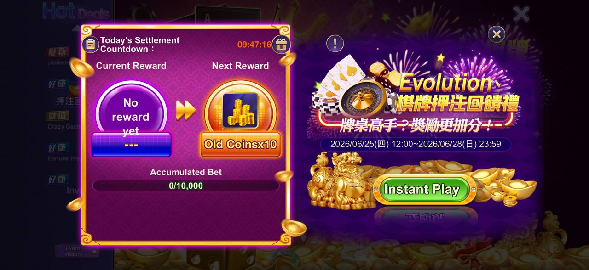
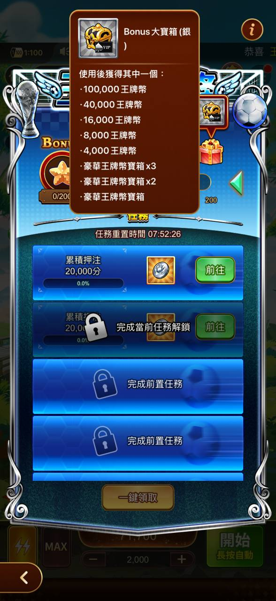

# 階段性任務

> 資料來源：慶宜ㄉ競品平台活動.xlsx（階段性任務）

  - 包你發 — 包你發 — 王牌 — 嚦咕
- 名稱 — 天天捕魚 — 天天衝等 — (遊戲名稱) — 捕魚大師 BONUS
- 活動時長 — 7日 — 3日
- 核心機制 — 押注及階段式獎勵 — 押注及階段式獎勵 — 階梯式返水
- 目標遊戲 — 指定幾款 — X — 新機 — 指定類別
## 包你發
      
      > 圖說：柏青斯洛回饋送，5天倒數，累積押注門檻對應回饋比例（5K~300K對應1%~1.5%）
  
  > 圖說：天天捕魚，回歸門檻獎勵/下期門檻獎勵，日曆式簽到，累積押注量進度條
      
      > 圖說：牌桌遊戲回饋送，累積押注門檻對應回饋%（100K~4M對應0.15%~0.32%）
  - 活動期間 — 2026/01/26 00:00 ~ 2026/02/01 23:59（共 7 天）。
  - 核心機制 — 每日累積押碼量，達到指定門檻即可領取對應階級的獎勵。
  - 重置時間 — 每日 00:00 結算並歸零。
  - 指定遊戲 — 捕魚類：財神捕魚、激鬥海皇、海皇爭霸-龍鳳傳說、海皇爭霸2-奪寶之戰。 老虎機類：霹靂遊俠、戰遊三國。
  - 獎勵結構
  - 階級 — 每日累積押碼門檻 — 獎項內容 (隨機卡包 x1) — 廳館區分
  - 13 — 160000000 — 高手廳 十星 — 高手廳
  - 12 — 128000000 — 高手廳 八星 — 高手廳
  - 11 — 100000000 — 高手廳 六星 — 高手廳
  - 10 — 72000000 — 高手廳 四星 — 高手廳
  - 9 — 44000000 — 高手廳 一星 — 高手廳
  - 8 — 20000000 — 一般廳 十星 — 一般廳
  - 7 — 16000000 — 一般廳 八星 — 一般廳
  - 6 — 12000000 — 一般廳 六星 — 一般廳
  - 5 — 8000000 — 一般廳 四星 — 一般廳
  - 4 — 4000000 — 一般廳 二星 — 一般廳
  - 3 — 2000000 — 一般廳 一星 — 一般廳
  - 2 — 400000 — 體驗廳 十星 — 體驗廳
  - 1 — 200000 — 體驗廳 五星 — 體驗廳
  
  > 圖說：天天衝等，活動日期04/10-04/12，回國等級提升活動，尚未獲得獎勵，5級威力卡
  
  > 圖說：傳奇廳木寶箱，累積押注進度0/14,400,000，重置任務/全部打開按鈕
      
      > 圖說：木寶箱，獎品範圍含1-5星戒力卡+遊戲獎勵卡、1-5星傳奇卡+遊戲獎勵卡
## 王牌
    
    > 圖說：星光遊戲園，錢包餘額45,000+，尚未獲得獎勵，累計押注量進度，x0.2%回饋比例
    - 活動期間 — 2026/01/29 12:00 ~ 2026/02/04 23:59。
    - 核心機制 — 「階梯式返水」，且針對不同 VIP 等級（卡別）設定了不同的返水比例
    - 重置時間 — 每日 00:00 結算並歸零。
    - 指定遊戲 — 柏青斯洛 — 星光馬戲團（休閒館除外）
    - 活動對象 — 限「銀卡」以上玩家參加
    - 備註：活動期間該機台的 BET 上限提高至 45,000
    - 💰 核心機制：階梯式返水
    - 活動採用每日累計押注、隔日領獎的方式：
    - 計算公式 — 每日累計總押注量 × 返水回饋百分比 = 返水回饋金。
    - 領獎方式 — 每日 23:59 結算，玩家可於隔日領取前一天的回饋金。
    - 結算邏輯 — 系統會根據玩家當日的「最高押注量」達成的門檻來發放對應獎勵。
    - 每日累計押注量 (分) — 黑鑽卡回饋率 — 鑽石卡回饋率
    - 500,000,000 以上 — 0.012 — 0.011
    - 300,000,000 以上 — 0.01 — 0.009
    - 100,000,000 以上 — 0.009 — 0.008
    - 50,000,000 以上 — 0.008 — 0.007
    - 10,000,000 以上 — 0.007 — 0.006
    - 1,000,000 以上 — 0.006 — 0.005
## 嚦咕
  
  > 圖說：捕魚大師BONUS，活動期間，每日簽到暫無獎勵，日曆式簽到條
    - 活動期間 — 2026/01/26 10:00 ~ 2026/02/01 18:00
    - 核心機制 — 1. 每日任務：每日達到指定押分門檻，可獲得對應的強運卡。 2. 活動 BONUS：整個活動週期內累積總押分達標，可額外獲得 5 星強運卡獎勵。
    - 重置時間 — 每日 00:00 結算並歸零。
    - 指定遊戲 — 僅限「捕魚遊戲」參與押分累積
    - 活動對象
    - 每日累計押分門檻 — 獎勵內容
    - 700 億 — 隨機 4 星強運卡 × 2
    - 500 億 — 隨機 3 星強運卡 × 10
    - 350 億 — 隨機 3 星強運卡 × 7
    - ... — ...
    - 20 億 (最低階) — 隨機 2 星強運卡 × 4
    - 總累積押分門檻 — 獎勵內容
    - 6666 億 — 隨機 5 星強運卡 × 1
  
  > 圖說：財富金庫，活動期間，我的鑰匙0/8個，金庫寶藏4選格子
    - 金幣押分拿鑰匙
      
      > 圖說：活動說明，基本規則/活動說明頁籤，各廳別貴賓點分別兌換不同禮券，越高級廳別可換越高級禮品
      
      > 圖說：活動說明，遊戲禮券兌換規則，每天最多15抽次，抽獎所得為玩家隨機取自禮物池的普通獎勵
## 老子
  
  > 圖說：摸彩活動，汽球主題，iPhone17Pro/現金獎項展示，My tickets/Claim按鈕
      
      > 圖說：Event Info，活動玩法說明廳別押注對應禮券規則（一般廳/初級廳、高級廳/黃金廳、貴賓廳/鑽石廳）
## 老子-階段式反水
  
  > 圖說：英文版Today's Settlement，Current/Next Reward，Evolution棋牌牌桌回饋轉，Instant Play按鈕
## 王牌-星星進度條任務
  
  > 圖說：Bonus大寶箱，使用後獲得其中一項（4,000~100,000王牌幣），任務重置倒數計時
