# 押注達標返水

> 資料來源：慶宜ㄉ競品平台活動.xlsx（押注達標返水）

## 王牌
  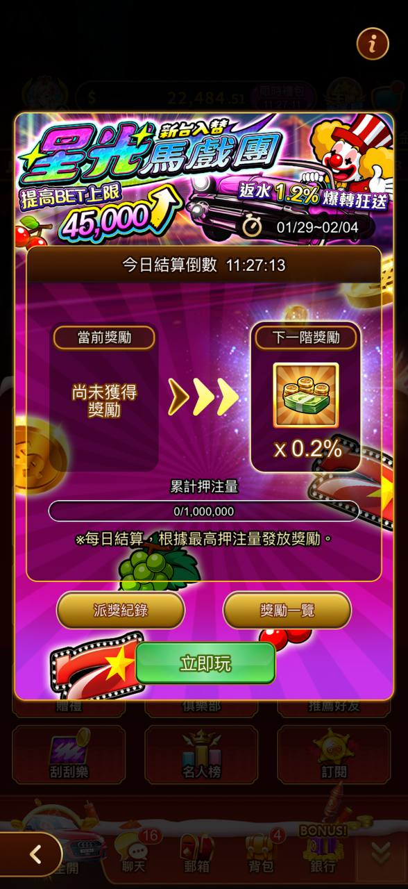
  > 圖說：星光遊戲園，錢包餘額45,000+，尚未獲得獎勵，累計押注量進度，x0.2%回饋比例
  - 活動期間 — 2026/01/29 12:00 ~ 2026/02/04 23:59。
  - 核心機制 — 「階梯式返水」，且針對不同 VIP 等級（卡別）設定了不同的返水比例
  - 重置時間 — 每日 00:00 結算並歸零。
  - 指定遊戲 — 柏青斯洛 — 星光馬戲團（休閒館除外）
  - 活動對象 — 限「銀卡」以上玩家參加
  - 備註：活動期間該機台的 BET 上限提高至 45,000
  - 💰 核心機制：階梯式返水
  - 活動採用每日累計押注、隔日領獎的方式：
  - 計算公式 — 每日累計總押注量 × 返水回饋百分比 = 返水回饋金。
  - 領獎方式 — 每日 23:59 結算，玩家可於隔日領取前一天的回饋金。
  - 結算邏輯 — 系統會根據玩家當日的「最高押注量」達成的門檻來發放對應獎勵。
  - 每日累計押注量 (分) — 黑鑽卡回饋率 — 鑽石卡回饋率
  - 500,000,000 以上 — 0.012 — 0.011
  - 300,000,000 以上 — 0.01 — 0.009
  - 100,000,000 以上 — 0.009 — 0.008
  - 50,000,000 以上 — 0.008 — 0.007
  - 10,000,000 以上 — 0.007 — 0.006
  - 1,000,000 以上 — 0.006 — 0.005
## 包你發
  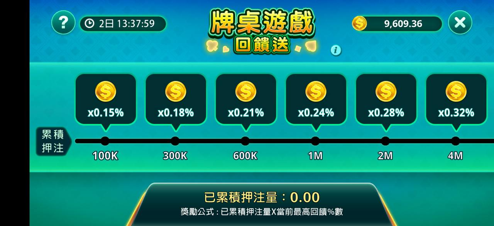
  > 圖說：牌桌遊戲回饋送，累積押注門檻對應回饋%（100K~4M對應0.15%~0.32%）
    - 活動說明：
    - 活動期間於指定遊戲進行遊戲，總累積押注達到指定門檻，活動結束後將擇優發放獎勵，並於一個工作日內送達玩家信箱
  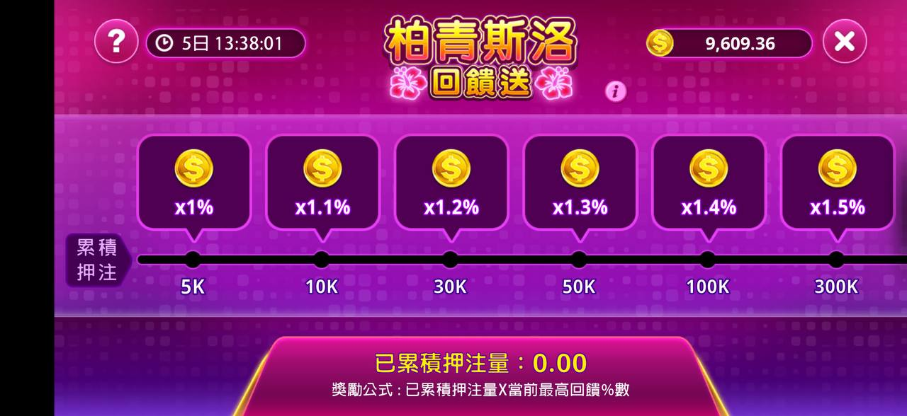
  > 圖說：柏青斯洛回饋送，5天倒數，累積押注門檻對應回饋比例（5K~300K對應1%~1.5%）
      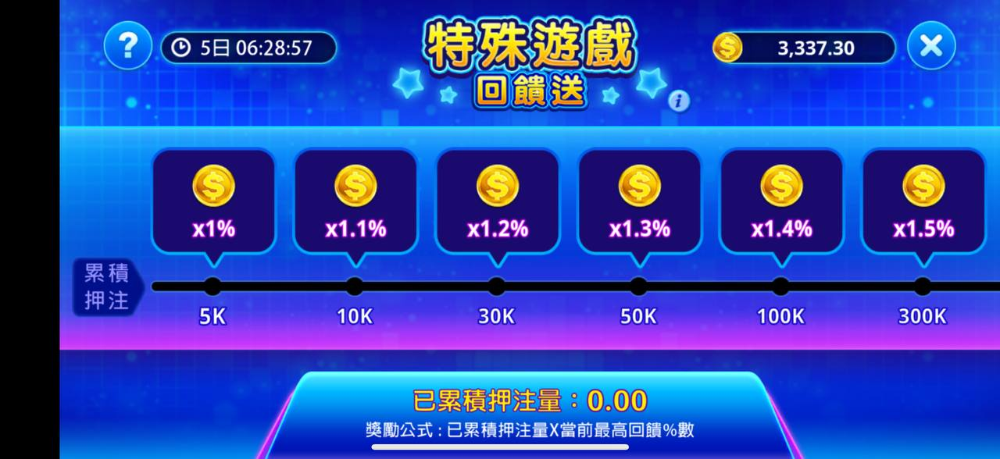
      > 圖說：特殊遊戲回饋送，累積押注門檻對應回饋%（5K~300K對應1%~1.5%）
## 王牌：外贈
  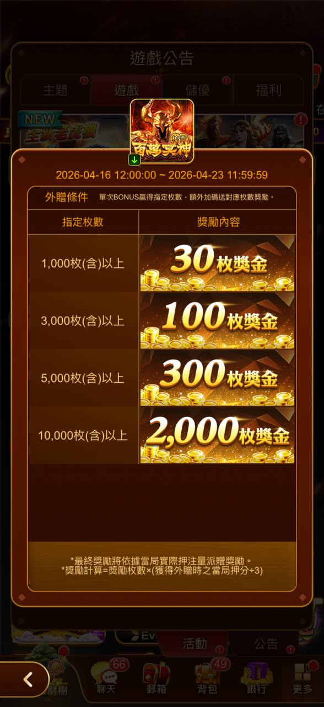
  > 圖說：遊戲公告，外幣提款門檻對應獎金（1,000枚=30枚獎金～10,000枚=2,000枚獎金）
## 嚦咕-返利回饋
  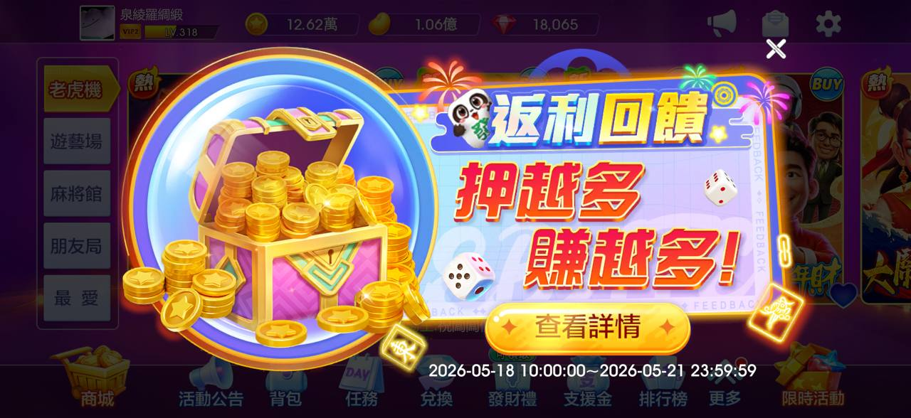
  > 圖說：返利回饋「押越多賺越多」，查看詳情按鈕
    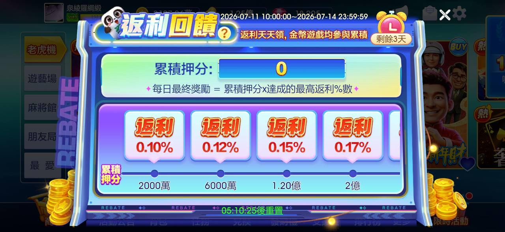
    > 圖說：返利回饋，累積押分對應返利%（2000萬=0.10%~2億=0.17%）
  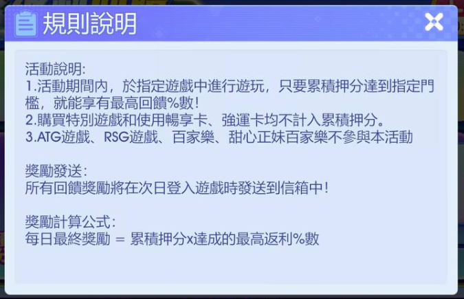
  > 圖說：規則說明，累積押分達門檻享回饋%數，特別遊戲/暢享卡/強運卡不計入累積押分，ATG/RSG/百家樂等不參與
## 嚦咕：外贈狂歡
  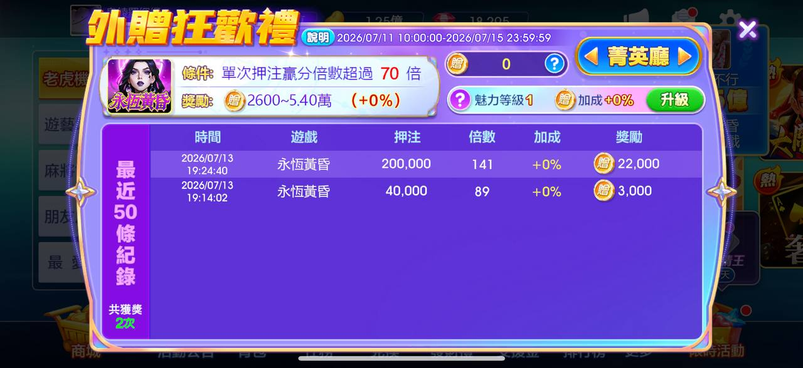
  > 圖說：外贈狂歡禮，單次押碼贏分倍歡超值70倍，最近50條贏紀錄列表
  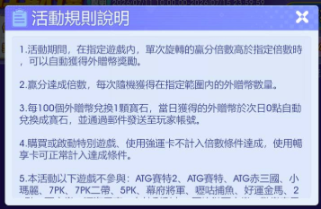
  > 圖說：活動規則說明，單次旋轉贏分倍數達指定倍數自動獲外贈幣獎勵，100個外贈幣兌換1顆寶石
## 豪神：外贈歡樂禮
  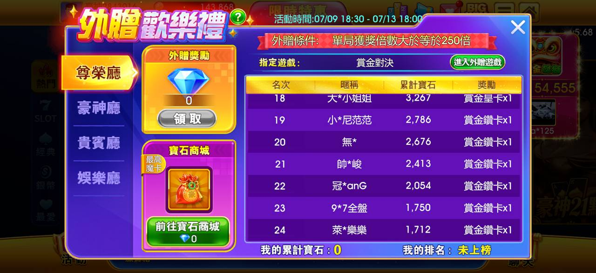
  > 圖說：外贈歡樂禮，婚樂廳/貴賓廳/娛樂廳頁籤，排行榜列表，我的累計寶石0
