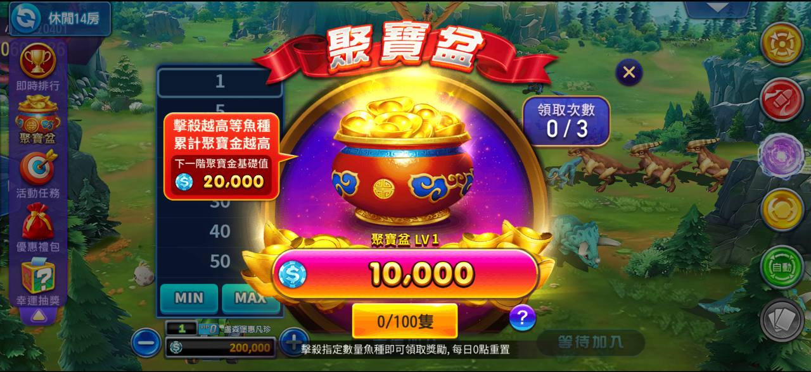
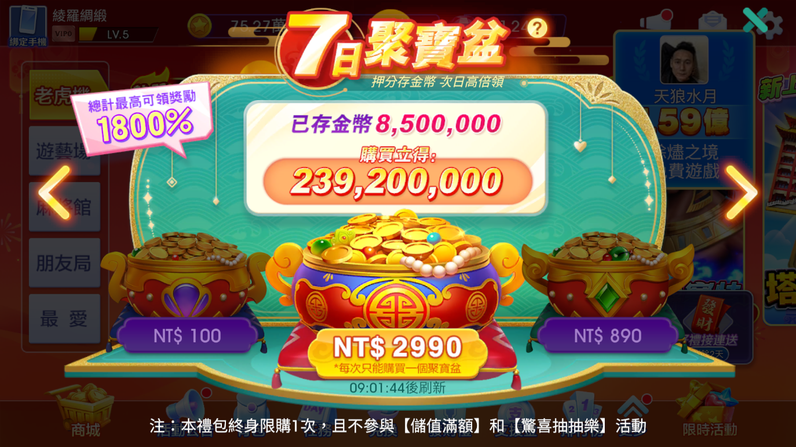
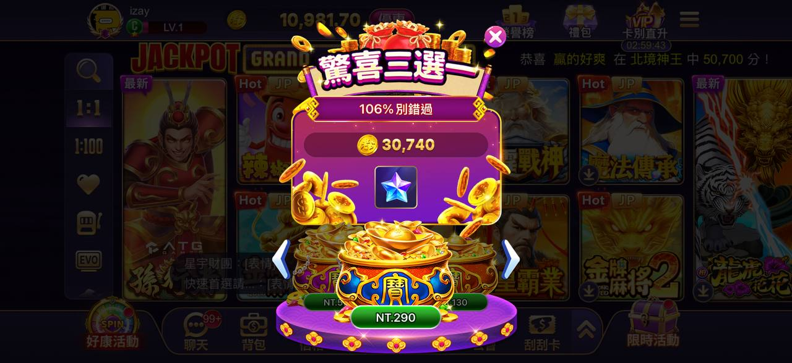

# 聚寶盆

> 資料來源：慶宜ㄉ競品平台活動.xlsx（聚寶盆）

## 滿貫
  
  > 圖說：聚寶盆，累計最高榮耀值20,000，累積獎金10,000，領取次數0/3
## 嚦咕
  
  > 圖說：7日聚寶盆，押分存金額次日直接領，已存金幣8,500,000，購買金額NT$100/2990/890
  - 一、 購買與領取機制
  - 選擇購買： 活動期間，玩家可從 3 個聚寶盆中任選 1 個購買。
  - 即時獎勵： 購買金幣聚寶盆後，可立即獲得一份金幣獎勵。
  - 每日領取： 之後每天可在此活動頁面領取一份聚寶盆金幣。
  - 二、 金幣累積方式
  - 自動轉換： 每天玩老虎機遊戲時，押分會按 0.3% 的比例自動轉換為金幣並存入聚寶盆。
  - 累積上限： 存入的金幣每天都有設定累積上限。
  - 加成獎勵： 第二天領取時可抽取額外倍數。
  - 最終獲得金幣獎勵 = 每日已存金幣 × 額外倍數
  - 累積邏輯： 累計押分越高，次日可領取的金幣就越多。
  - 三、 限制與排除項目
  - 不支援的遊戲： 好運金馬、百家樂、21點、深海尋寶、區塊鏈百家樂、歡樂賓果。
  - 不支援的道具： 使用「強運卡」和「暢享卡」玩遊戲時，押分不會轉換成金幣。
  - 不支援的消費： 老虎機內購買「特別遊戲」所消耗的金幣押分，不計入轉換。
  - 四、 注意事項
  - 重置時間： 每天 0 點自動重置活動狀態。
  - 領取時限： 若重置後至次日 0 點仍未領取金幣，將無法獲得前一日的活動獎勵。
  - 活動排他性： 購買本禮包不參與【驚喜抽抽樂】與【儲值滿額】活動。
## 老子
  
  > 圖說：驚喜三選一，106%創牌率，30,740金額展示
