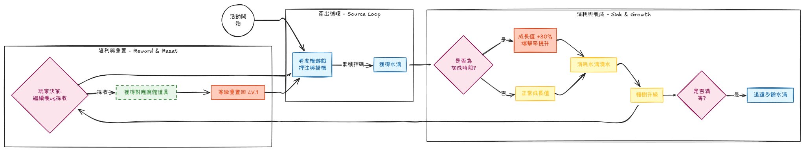
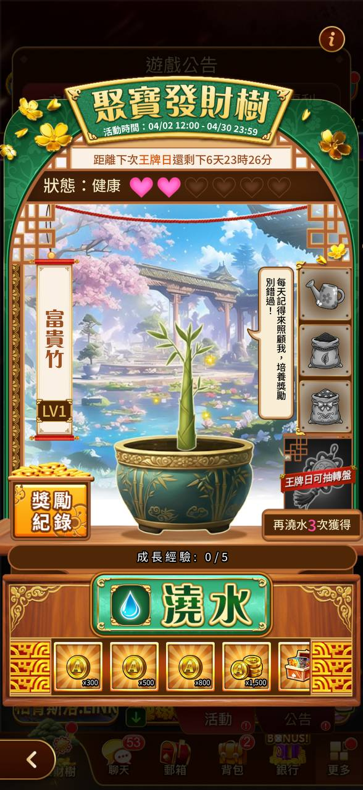
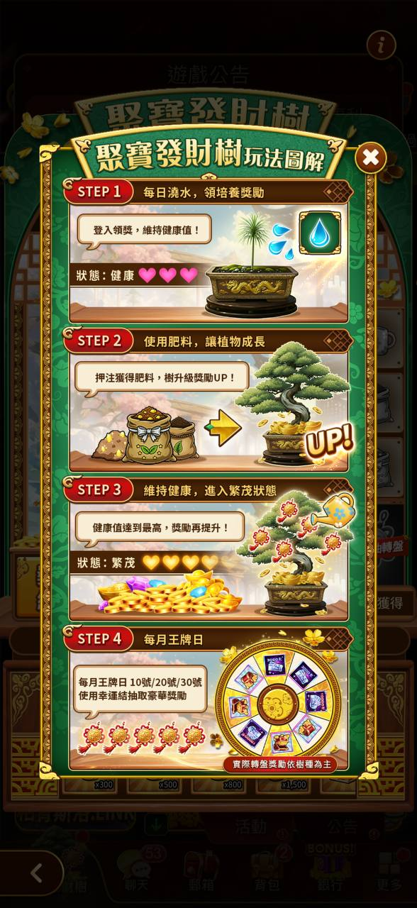

# 澆水

> 資料來源：慶宜ㄉ競品平台活動.xlsx（澆水）

  - 規格名稱 — 水滴灌福運
  - 舉辦平台 — 聚寶 ONLINE
  - 舉辦時間 — 2025/9/15(一) 00:00~2025/9/21(日) 23:59
  - 目的
    - ● — 透過「養成機制」將玩家的押注行為與長期留存進行綁定
    - ● — 利用特定時段加成來控制伺服器的同時在線人數
  - 標籤
    - 【押注】 — 玩家必須在老虎機持續押注才能獲取活動道具（水滴）
    - 【同上】 — 透過每日三個「加成時段 (Boost Time)」，引導玩家集中在特定時間上線，製造熱門時段
    - 【留存】 — 累積升級型規格，須等到升級後才能獲得獎勵，吸引玩家次日再登入
  - 資源循環
      
      > 圖說：內部活動邏輯流程圖（規劃用，非玩家畫面）
    - ● — 積累期 (Accumulation)：
    - 玩家在「產出循環」中透過掛機消耗金幣，將本金轉化為活動積分（水滴）。這是營運回收遊戲幣的主要手段。
    - ● — 等待期 (Timing)：
    - 玩家持有水滴後，不會立即消耗，而是傾向等待「加成時段」。這造成了平時段的資源囤積與特定時段的爆發性消耗。
    - ● — 博弈決策 (The Gamble)：
    - 循環中最關鍵的節點在於「採收」。
    - 短期循環：升到 LV.10 就採收 -> 拿小獎 -> 重置 -> 循環快但獎勵差。
    - 長期循環：忍住不採收，一路養到 LV.33 -> 拿大獎 -> 重置 -> 風險高但回報大。
  - 優點 — 優點
    - ● — 極強的留存黏著度 — ● — 誤操作挫折感強
    - 由於「採收即重置」，如果玩家養到 LV.20 就放棄活動，沈沒成本極大。這迫使玩家一旦開始「衝高等」就必須把活動跑完，有效鎖定活動期間的 DAU。 — 若玩家在目標達成前（例如想衝 LV.33 但在 LV.30 時）誤觸「採收」按鈕，等級瞬間歸零，會產生極大的負面情緒，甚至導致退坑。建議 UI 上需有「採收二次確認」彈窗
    - ● — 精準的人流控制 — ● — 後期乏力
    - 透過每日三次的加成時段，營運方可以人為製造「上線高峰」，讓遊戲看起來隨時都很熱鬧，同時培養玩家定時上線的習慣 — 若活動天數較長，當玩家完成一次 LV.33 循環後，面對等級重置回 LV.1 的巨大落差，可能會喪失開啟第二輪循環的動力
    - ● — 清晰的分層付費設計
    - 不同等級對應不同廳館（大眾/貴賓/尊榮）的道具。大R玩家（尊榮廳用戶）目標明確（LV.33），小R玩家（歡樂廳用戶）也有低門檻目標（LV.17），滿足不同客群。
  - 規格說明
    - 核心玩法
    - ● — 基本循環：玩家透過玩老虎機獲得「水滴」，消耗水滴對「福樹」澆水累積成長值。
    - ● — 產出獎勵：採收時必定獲得虛寶（如鴻運卷軸、招財樹），獎勵價值隨等級階梯式提升：
    - LV.2 ~ LV.17：對應歡樂廳/大眾廳的 1~8 星道具。
    - LV.18 ~ LV.33：對應貴賓廳/尊榮廳的 1~8 星道具（高價值目標）。
    - ● — 玩家吸引點：
    - 可視化成長：隨著澆水，福樹等級與外觀產生變化，滿足養成成就感。
    - 決策博弈：玩家需在「立即變現（採收小獎）」與「延遲滿足（冒險衝大獎）」之間做抉擇，增加了心理博弈的刺激感。
    - ● — 特殊機制：
    - 加成時段：每日 02:00-04:00、12:00-14:00、20:00-22:00，澆水成長值 +30%。
    - 爆擊設定：使用大容量澆水器有機會觸發爆擊，消耗較少水滴獲得高成長。
    - 重置規則：採收獎勵後，福樹等級強制重置為 LV.1。
  
  > 圖說：水滴灌福運，活動09/15-09/21，收集水滴澆水趣，高星道具來報到
## 王牌-澆水
  
  > 圖說：聚寶發財樹，狀態健康，成長階段0/5，澆水按鈕
  
  > 圖說：聚寶發財樹玩法簡介，STEP1植入盆栽→STEP2澆水施肥→STEP3摘取進入寶藏節點→STEP4每日摘取
