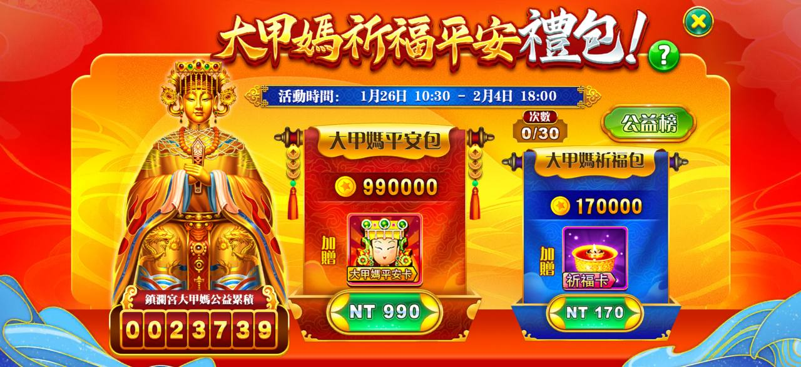
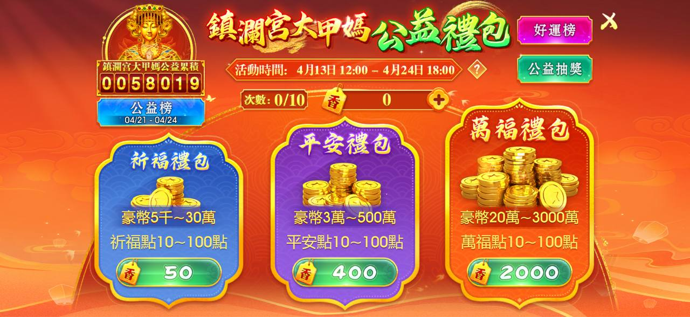

# 公益類

> 資料來源：慶宜ㄉ競品平台活動.xlsx（公益類）

- 豪神
  
  - 活動時間 — 1/26-2/4
  - 公益性質 — 累積的公益金在活動結束後，將全數捐贈至「財團法人大甲媽社會福利基金會附設臺中市私立鎮瀾兒童家園」
  - 購買限制 — 禮包購買上限次數為 30次
  - 禮包名稱 — 售價 (NT) — 獲得遊戲幣 — 加贈道具
  - 大甲媽萬福包 — 一次加贈 10 張平安卡，且購買次數會直接計為 10 次
  - 大甲媽平安包 — $990 — 990000 — 大甲媽平安卡
  - 大甲媽祈福包 — $170 — 170000 — 大甲媽祈福卡
  - 平安卡 / 祈福卡 — 於背包開啟平安卡或祈福卡，可隨機獲得「豪幣」或「特別獎」。 開啟道具時，必定會產出隨機的「公益點數」，這應該就是左下角顯示的累積總額來源。
  
